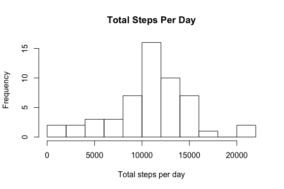
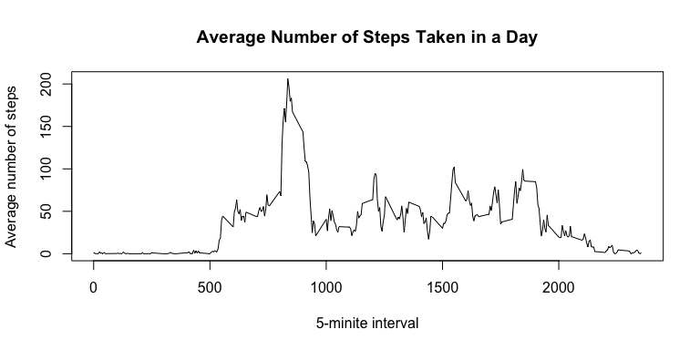
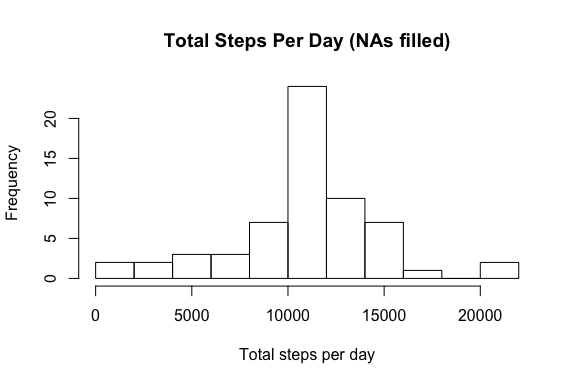
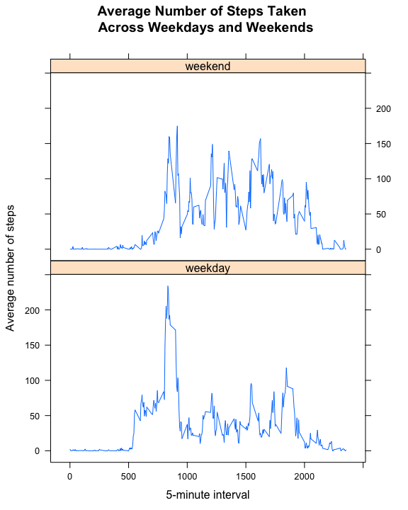

<!-- Jiankun Sun, 14 Mar 2021 -->

## Loading and preprocessing the data

We load the data directly from the Github repository into **data_na**. We coerce the **date** variable into the Date class. Then we revome the missing values and store the processed data in **data**. The first six lines of the processed data are shown as follows.


```r
setwd("/Users/jsun3/Box Sync/Study/Coursera/DataScienceSpecialization/05_ReproducibleResearch/quiz&assignments/assignment1/RepData_PeerAssessment1")
data_na <- read.csv("activity.csv")
data_na$date <- as.Date(data_na$date)
good <- complete.cases(data_na)
data <- data_na[good, ]
head(data)
```

```
##     steps       date interval
## 289     0 2012-10-02        0
## 290     0 2012-10-02        5
## 291     0 2012-10-02       10
## 292     0 2012-10-02       15
## 293     0 2012-10-02       20
## 294     0 2012-10-02       25
```

## What is mean total number of steps taken per day?

First, we calculate the total number of steps taken per day with function **tapply**. We use data without missing values for calculation in this part. Note that we still need to remove missing values from the final result, because the processed data still keeps all dates in structure though steps are all missing values for some dates.


```r
total_steps_na <- tapply(data$steps, data$date, sum)
total_steps <- total_steps_na[!is.na(total_steps_na)]
```

Second, we make a histogram of the total number of steps taken each day.


```r
par(mfrow = c(1,1))
hist(total_steps, main = "Total Steps Per Day", xlab = "Total steps per day", nclass = 10)
```

<!-- -->

Third, we calculate the mean and median of the total number of steps taken per day. The mean of the total number of steps is 10766.19 and the median is 10765.


```r
mean(total_steps)
```

```
## [1] 10766.19
```


```r
median(total_steps)
```

```
## [1] 10765
```

## What is the average daily activity pattern?

First, we calculate the average number of steps taken accross all days for each 5-minute interval and make the time-series plot. We use data without NAs to calculate the mean in this part.


```r
ave_steps_5min <- tapply(data$steps, data$interval, mean)
interval_factor <- as.factor(data$interval)
interval_levels <- levels(interval_factor)
par(mfrow = c(1,1))
plot(interval_levels, ave_steps_5min, type = "l", main = "Average Number of Steps Taken in a Day", xlab = "5-minite interval", ylab = "Average number of steps")
```

<!-- -->

Then we can find out the 5-minute interval with maximum number of steps, which is the interval 835.


```r
interval_levels[which.max(ave_steps_5min)]
```

```
## [1] "835"
```

## Imputing missing values

First, we calculate the total number of missing values in the dataset. The total number of missing values is 2304.


```r
bad <- !complete.cases(data_na)
total_nas <- sum(bad)
total_nas
```

```
## [1] 2304
```

Now we need to fill in the missing values. The strategy we adopt is replacing the missing value with the mean of steps for the corresponding 5-minute interval.

Then we create a new dataset with missing values all filled in. The first six lines of the processed data are shown as follows.


```r
data_filled <- data_na
for (i in which(bad)){
    data_filled$steps[i] <- ave_steps_5min[which(interval_levels == data_filled$interval[i])] 
}
head(data_filled)
```

```
##       steps       date interval
## 1 1.7169811 2012-10-01        0
## 2 0.3396226 2012-10-01        5
## 3 0.1320755 2012-10-01       10
## 4 0.1509434 2012-10-01       15
## 5 0.0754717 2012-10-01       20
## 6 2.0943396 2012-10-01       25
```

Now we make a histogram of the total number of steps taken each day.


```r
total_steps_filled <- tapply(data_filled$steps, data_filled$date, sum)
par(mfrow = c(1,1))
hist(total_steps_filled, main = "Total Steps Per Day (NAs filled)", xlab = "Total steps per day", nclass = 10)
```

<!-- -->

Finally we calculate the mean and median total number of steps taken per day with the new filled dataset. Now both the mean and the median are 10766.19. 


```r
mean(total_steps_filled)
```

```
## [1] 10766.19
```


```r
median(total_steps_filled)
```

```
## [1] 10766.19
```

Compared with the estimates in the first part, the two means are the same while the medians are slightly different (the median in the filled dataset is slightly higher), which makes perfectly sense considering our filled strategy and the fact that the distribution of total number of steps per day is kind of negative skewed. The histogram of the total number of steps remains mostly the same as that in part 1 except that the freqency in [10000, 12000] is increased, which is also reasonable. Therefore, imputing missing data with our strategy just slightly changes the median and the distribution of total number of steps per day and the impact is really minor.

## Are there differences in activity patterns between weekdays and weekends?

First, we create a new factor variable in the dataset with two levels – “weekday” and “weekend” indicating whether a given date is a weekday or weekend day. We use data without NAs for future calculation in this part. The first six lines of the new dataset are shown as follows.


```r
data$daytype <- ifelse(weekdays(data$date) %in% c("Saturday", "Sunday"), "weekend", "weekday")
head(data)
```

```
##     steps       date interval daytype
## 289     0 2012-10-02        0 weekday
## 290     0 2012-10-02        5 weekday
## 291     0 2012-10-02       10 weekday
## 292     0 2012-10-02       15 weekday
## 293     0 2012-10-02       20 weekday
## 294     0 2012-10-02       25 weekday
```

Now we make a panel plot containing a time series plot of the 5-minute interval (x-axis) and the average number of steps taken, averaged across all weekday days or weekend days (y-axis). We can see that there are different activity patterns between weekdays and weekends. On the weekdays, people's activity reaches a peak around the interval 800 and 900, and then sharply decreases and stays at a low level. However, on the weekends, people's activity levels are relatively more steady and higher than those on the weekdays in general.


```r
library(dplyr)
```

```
## 
## Attaching package: 'dplyr'
```

```
## The following objects are masked from 'package:stats':
## 
##     filter, lag
```

```
## The following objects are masked from 'package:base':
## 
##     intersect, setdiff, setequal, union
```

```r
library(lattice)
group <- group_by(data, interval, daytype)
ave_steps_group <- summarize(group, ave_steps = mean(steps, na.rm = TRUE))
par(mfrow = c(1,1))
xyplot(ave_steps ~ interval | daytype, data = ave_steps_group, type = "l", main = "Average Number of Steps Taken \n Across Weekdays and Weekends", xlab = "5-minute interval", ylab = "Average number of steps")
```

<!-- -->

